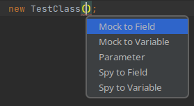
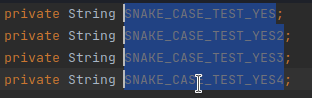
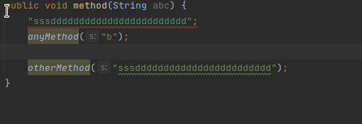
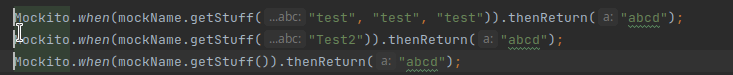

# MoreShortcuts for Intellij

This plugin adds more shortcuts to intellij idea.

## Installation

Get it from the [Intellij Marketplace](https://plugins.jetbrains.com/plugin/17814-more-shortcuts/)

----------------------

## Smart Introduce

Put your cursor on any method/constructor call and this action will open
up a short context menu for further actions:

PS: You can even add the behaviour to prefilled methods/constructors, by using "null" as a marker.

### Mock to Field

Before

    void abc() {
        new TestClass();
    }

After

    @Mock
    String a;
    @Mock
    String b;
    @Mock
    Integer abc;
    @Mock
    Integer hhjk;

    void abc() {
        new TestClass(a, b, abc, hhjk);
    }

### Mock to Variable

Before

    void abc() {
        new TestClass();
    }

After

    void abc() {
        var a = Mockito.mock(String.class);
        var b = Mockito.mock(String.class);
        var abc = Mockito.mock(Integer.class);
        var hhjk = Mockito.mock(Integer.class);

        new TestClass(a, b, abc, hhjk);
    }

### Parameter

Before

    void abc() {
        new TestClass();
    }

After

    void abc(String a, String b, Integer abc, Integer hhjk) {
        new TestClass(a, b, abc, hhjk);
    }

### Spy to Field

Before

    void abc() {
        new TestClass();
    }

After

    @Spy
    String a;
    @Spy
    String b;
    @Spy
    Integer abc;
    @Spy
    Integer hhjk;

    void abc() {
        new TestClass(a, b, abc, hhjk);
    }

### Spy to Variable

Before

    void abc() {
        new TestClass();
    }

After

    void abc() {
        var a = Mockito.spy(String.class);
        var b = Mockito.spy(String.class);
        var abc = Mockito.spy(Integer.class);
        var hhjk = Mockito.spy(Integer.class);

        new TestClass(a, b, abc, hhjk);
    }

`----------------------

## Add Mock Method (implements [VariableFinder](#variablefinder))

Creates a mock method for the given method. Put cursor on a variable/field, execute "Add Mock Method"
action (**CTRL + M, CTRL + M**), select a method and a mock for a method will appear. It is smart enough to find the
correct argument matchers of Mockito based on the type.

Before

    var string[cursor] = Mockito.mock(String.class);

After

    var string = Mockito.mock(String.class);
    Mockito.when(string.compareTo(any())).thenReturn([cursor]null);

----------------------

## Add Verify Method (implements [VariableFinder](#variablefinder))

Similar to the [Add Mock Method](#add-mock-method) shortcut, this shortcut (**CTRL + M, CTRL + C**)
will introduce a correctly implemented Mockito.verify of the chosen method.

Also the [Variable finder](#new-feature-variable-finder) can search the current method for variables, to create the
Mockito.Verify directly from anywhere.

Before

    var string[cursor] = Mockito.mock(String.class);

After

    var string = Mockito.mock(String.class);
    Mockito.verify(string).compareTo([cursor]any());

----------------------

## Multiline Counting

Every need to rename alot of variables in a sequential way? **CTRL + M, CTRL + 1** on a multiline cursor will open a
small popup to set a starting index and an interval. The plugin will insert the start number and then write sequential
numbers based on the interval.

PS: this does also work for characters, just insert "A" or "a" to count in uppercase and lowercase letters

----------------------

## NamingSchemeCycling

Ever needed to switch naming schemes of a selection? **CTRL + SHIFT + ALT + U** and the selection will cycle through
naming schemes. Currently supported are: **camelCase, dot.case, PascalCase, SNAKE_CASE and doener-case**.

----------------------

## SmartPaste

Copy some code and paste it onto a selected text via **ALT + V**. Depending on the content of the clipboard and the text
selection a different behaviour occurs (with multi cursor support!):

| Clipboard              | Selection                  | Result                                                      |
|------------------------|----------------------------|-------------------------------------------------------------|
| coolMethod(            | "abc"                      | coolMethod("abc")                                           |
| coolMethod(            | "abc";                     | coolMethod("abc");                                          |
| "def"                  | coolMethod("abc");         | coolMethod("def");                                          |
| var newString = "abc"; | public void coolMethod() { | public void coolMethod {  var newString = "abc";  } |
| <any-html-brackets>    | any cool text              | <any-html-brackets>any cool text</any-html-brackets>        |

----------------------

## Switch Mockito Mocking Variant

Put cursor (or multi cursor!) on a line and switch between Mockito.when and Mockito.doReturn
mock method variants via **CTRL + M, CTRL + S**. You can also just select the whole text segment to refactor
mockings, which are longer then 1 line.

----------------------

## Lombok to MapStruct generator

NEW: Moved to a new plugin called [MapStructor](https://github.com/AskMeAgain/MapStructor) with more features.

----------------------

## Insertion CodeLense

A small code editor opens when pressing **CTRL + I, CTRL + A**.
The cursor is placed at the top of the current file, to enter new annotations.
Pressing **escape** closes the window

Press **CTRL + I, CTRL + V** to open a window on the next field;
Press **CTRL + L, CTRL + F** to open a window on the selected class;

----------------------

## VariableFinder

if your cursor is not on a variable and you press a shortcut which implements the variable finder, the plugin will
search for all possible variable declarations and will provide you with a list of possible cases to chose from. It will
then apply the shortcut to the selected variable:

