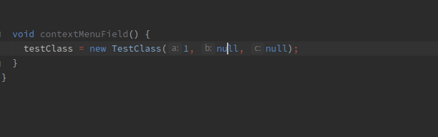
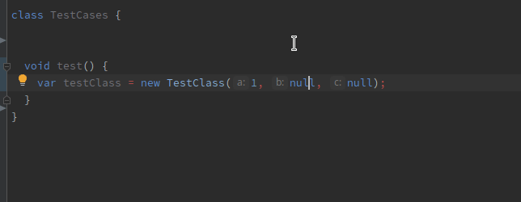
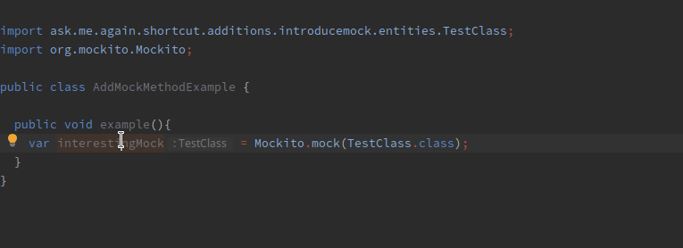

# Intellij Shortcut Additions

This plugin adds some shortcuts to intellij idea

## Installation

It is currently not in the intellij plugin marketplace, but you can install it manually

1. Settings
2. Plugins
3. Settings Cog (top right)
4. Install Plugin from disk
5. Select jar

----------------------

## Introduce Mock To Variable

Introduces Mockito mocks for every "null" value of the class. Place cursor inside the brackets 
and run the "Introduce Mock To Variable" action. Its also smart enough, 
that if a conflict arises it asks for the correct implementation via context menu

----------------------

## Introduce Mock To Field

Introduces Mockito mock fields for every "null" value of the class. Place cursor inside the brackets
and run the "Introduce Mock To Field" action. Its also smart enough,
that if a conflict arises it asks for the correct implementation via context menu

----------------------

## Add Mock Method

put cursor on a variable and a context menu with public non-void methods will appear.
Select a method and an mock for a method will appear. It is smart enough to 
find the correct argument matches based on the type.

