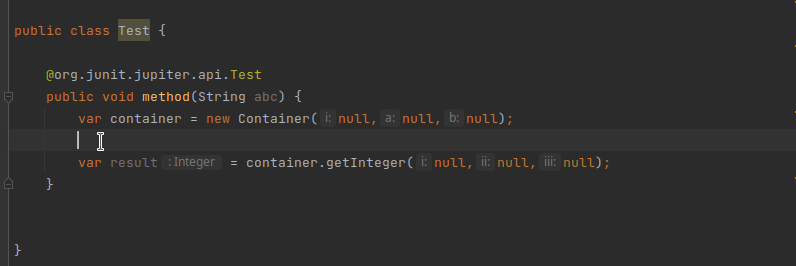
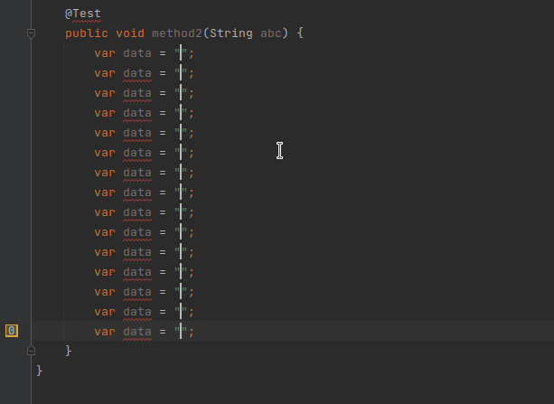

# Intellij Shortcut Additions

This plugin adds some shortcuts to intellij idea

## Installation

Get it from the [Intellij Marketplace](https://plugins.jetbrains.com/plugin/17814-shortcut-additions)

----------------------

## Introduce Mock To Variable

Introduces Mockito mocks for every "null" value of the class. Place cursor inside the brackets and run the "Introduce
Mock To Variable" action (**CTRL + M, CTRL + V**). In case of a conflict a context menu pops up to resolve it.

Before

    void example() {
        var result = new TestClass(null, null);
    }

After

    void example() {
        var string1 = Mockito.mock(String.class);
        var string2 = Mockito.mock(String.class);

        var result = new TestClass(string1, string2);
    }

----------------------

## Introduce Mock To Field

Introduces Mockito mock fields for every "null" value of the class. Place cursor inside the brackets and run the "
Introduce Mock To Field" action (**CTRL + M, CTRL + F**). Its also smart enough, that if a conflict arises it asks for
the correct implementation via context menu

Before

    class IntroduceMockFieldExample {
        void example() {
            var result = new TestClass([cursor]null,null);
        }
    }

After

    class IntroduceMockFieldExample {
        @Mock
        String string1;
        @Mock
        String string2;
    
        void example() {
            var result = new TestClass(string1, string2);
        }
    }

----------------------

## Add Mock Method

Creates a mock method for the given method. Put cursor on a variable/field, execute "Add Mock Method"
action (**CTRL + M, CTRL + M**), select a method and a mock for a method will appear. It is smart enough to find the
correct argument matchers of Mockito based on the type.

Before

    var string[cursor] = Mockito.mock(String.class);

After

    var string = Mockito.mock(String.class);
    Mockito.when(string.compareTo(any())).thenReturn([cursor]null);

----------------------

## Add Verify Method

Similiar to the [Add Mock Method](#add-mock-method) shortcut, this shortcut (**CTRL + M, CTRL + C**)
will introduce a correctly implemented Mockito.verify of the chosen method.

Also the [Variable finder](#new-feature-variable-finder) can search the current method for variables, to create the
Mockito.Verify directly from anywhere.

Before

    var string[cursor] = Mockito.mock(String.class);

After

    var string = Mockito.mock(String.class);
    Mockito.verify(string).compareTo([cursor]any());

----------------------

## New feature: Variable finder

if your cursor is not on a variable and you press a shortcut which implements the variable finder, the plugin will
search for all possible variable declarations and will provide you with a list of possible cases to chose from. It will
then apply the shortcut to the selected variable:

----------------------

## Multiline Counting

Every need to rename alot of variables in a sequential way? **CTRL + M, CTRL + 1** on a multiline cursor will open a
small popup to set a starting index and an interval. The plugin will insert the start number and then write sequential
numbers based on the interval

